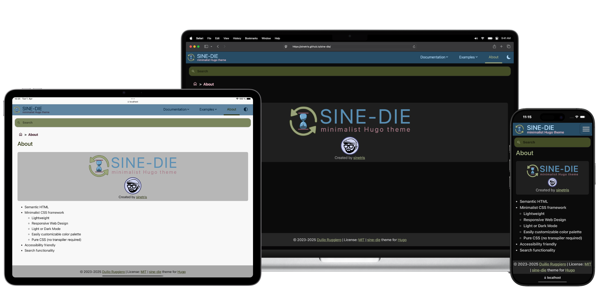

<!-- markdownlint-disable MD041 -->

<p align="center">

</p>

<p align="center">

</p>

---

Table of Content

- [Description](#description)
- [Prerequisites](#prerequisites)
- [Setup and run the example site locally](#setup-and-run-the-example-site-locally)
- [Add the sine-die theme to your Hugo site](#add-the-sine-die-theme-to-your-hugo-site)
  - [Search functionality](#search-functionality)
    - [Installing and running Pagefind](#installing-and-running-pagefind)
- [Credits and Acknowledgements](#credits-and-acknowledgements)
- [License](#license)

## Description

A simple and clean [Hugo][hugo] theme.

- Semantic HTML
- Minimalist CSS framework
  - Lightweight
  - Responsive Web Design
  - Light/Dark Mode
  - Easily customizable color palette
  - Menubar
- Glossary templates
- Accessibility friendly
- Search functionality

## Prerequisites

- A [Hugo site][hugo-quick-start]
- [Git installed][git-getting-started]
- (optional) For the [Search functionality](#search-functionality)
  - [Node.js][node-js] or [Python 3][python] (used by Pagefind)
  - [Pagefind][pagefind]
- [Dart Sass][hugo-dart-sass]

## Setup and run the example site locally

Install required [prerequisites](#prerequisites).

Clone the [sine-die](https://github.com/sinetris/sine-die) repository and move
to the `userguide` directory.

```shell
git clone https://github.com/sinetris/sine-die.git sine-die
cd sine-die/userguide
```

Install and run `pagefind` to generate the search indexes from the static files
(see [Search functionality](#search-functionality)).

Run the site locally

```shell
hugo server \
  --buildDrafts \
  --tlsAuto \
  --disableFastRender
```

## Add the sine-die theme to your Hugo site

Add the sine-die theme to your Hugo site as a git submodule:

```shell
git submodule add https://github.com/sinetris/sine-die themes/sine-die
```

Edit `hugo.toml` and change the theme to `theme = 'sine-die'`.

### Search functionality

To enable the search functionality, edit `hugo.toml` and add `showSearchUI = true`
in `[params]`.

The search functionality uses [Pagefind][pagefind].

> **Note:** to allow Pagefind to run the indexing script, you must first build
> the static files for your website.

Build the static files for your website, for example running:

```shell
hugo
```

You can install and run Pagefind using the Node.js or Python3 wrappers (more info
can be found in [Pagefind installation documentation][pagefind-installation]).

<details>
  <summary>
    Using <code>pyenv</code> for Python 3 or <code>asdf</code> for Node.js
  </summary>

  If you want to use **Python 3** and are using [pyenv][pyenv], you can install
  Python 3 version from [.python-version](userguide/.python-version) running:

  ```shell
  pyenv install
  ```

  If you want to use **Node.js** and are using [asdf][asdf], you can install
  the Node.js version from [.tool-versions](userguide/.tool-versions) running:

  ```shell
  # Install Node.js plugin for asdf
  asdf plugin add nodejs https://github.com/asdf-vm/asdf-nodejs.git
  # Run 'asdf set nodejs latest' if you want to update Node.js to the latest version.
  # Install Node.js
  asdf install
  ```

</details>

#### Installing and running Pagefind

To install and run Pagefind with Node.js, run:

```shell
npx pagefind --site "public"
```

To install and run Pagefind with Python 3, run:

```shell
# Install pagefind
python3 -m pip install 'pagefind[extended]'
# Run pagefind
python3 -m pagefind --site "public"
```

You can use [Pagefind CLI config sources][pagefind-config-sources] instead of passing
CLI flags. Check [userguide/pagefind.yaml](userguide/pagefind.yaml) for an example.

## Credits and Acknowledgements

- [Pagefind][pagefind]: highly configurable client-side search
  library with a script to index pages generated with any static site generator
  using as low bandwidth as possible. It also provides a UI component that
  supports searching, filtering, and metadata out of the box.
- [MDN Accessibility][mdn-accessibility]: web accessibility reference in
  [MDN Web Docs][mdn-web-docs]
- [ARIA Authoring Practices Guide (APG)][aria-apg]: learn to use the accessibility
  semantics defined by the [ARIA][aria] specification.
- [Material Design][material-design]: Google’s open-source design system.
  - The color scheme for this theme is inspired by the [Material design color system][material-design-color-system].\
    Their color palette is very similar to what I intended to cerate, and having
    a good reference was definitely a great help.
  - This theme also use [Material Symbols][material-symbols] for the icons.

## License

Licensed under the [MIT license](LICENSE).

This software includes material copied from or derived from the example patterns
provided in the [ARIA Authoring Practices Guide (APG)][aria-apg] and distributed
under the [W3C<sup>®</sup> Software and Document License][w3c-software-license].

Specifically:

- [Breadcrumb Pattern][aria-apg-patterns-breadcrumb]
- [Menu and Menubar Pattern][aria-apg-patterns-menubar]

[aria-apg-patterns-breadcrumb]: <https://www.w3.org/WAI/ARIA/apg/patterns/breadcrumb/> "APG - Breadcrumb Pattern"
[aria-apg-patterns-menubar]: <https://www.w3.org/WAI/ARIA/apg/patterns/menubar/> "APG - Menu and Menubar Pattern"
[aria-apg]: <https://www.w3.org/WAI/ARIA/apg/> "ARIA Authoring Practices Guide (APG)"
[aria]: <https://www.w3.org/TR/wai-aria/> "Accessible Rich Internet Applications (WAI-ARIA)"
[asdf]: <https://asdf-vm.com/> "asdf: The Multiple Runtime Version Manager"
[git-getting-started]: <https://git-scm.com/book/en/Getting-Started-Installing-Git/> "Git: Getting Started"
[hugo-dart-sass]: <https://gohugo.io/functions/css/sass/#dart-sass> "Hugo: Install Dart Sass"
[hugo-quick-start]: <https://gohugo.io/getting-started/quick-start/> "Hugo: Quick start"
[hugo]: <https://gohugo.io> "Hugo: open-source static site generators"
[material-design-color-system]: <https://m3.material.io/styles/color/the-color-system/key-colors-tones> "Material design color system"
[material-design]: <https://m3.material.io> "Material Design"
[material-symbols]: <https://fonts.google.com/icons> "Material Symbols"
[mdn-accessibility]: <https://developer.mozilla.org/en-US/docs/Web/Accessibility> "mdn - Accessibility"
[mdn-web-docs]: <https://developer.mozilla.org/en/docs/Web> "mdn web docs"
[node-js]: <https://nodejs.org> "Node.js"
[pagefind-config-sources]: <https://pagefind.app/docs/config-sources/> "Pagefind CLI configuration sources"
[pagefind-installation]: <https://pagefind.app/docs/installation/> "Pagefind installation"
[pagefind]: <https://pagefind.app/> "Pagefind"
[pyenv]: <https://github.com/pyenv/pyenv> "pyenv: Simple Python version management"
[python]: <https://www.python.org/> "Python"
[w3c-software-license]: <https://www.w3.org/copyright/software-license/> "W3C Software and Document License"
