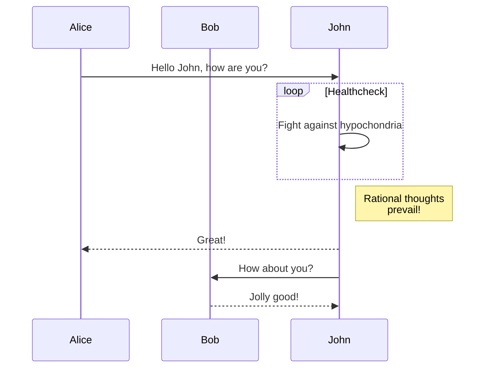

You can use [mermaid](https://mermaid.js.org/) in your Markdown content.

For example:

````md
## Mermaid

A mermaid diagram example.


````

Will be rendered as:

## Mermaid

A mermaid diagram example.


